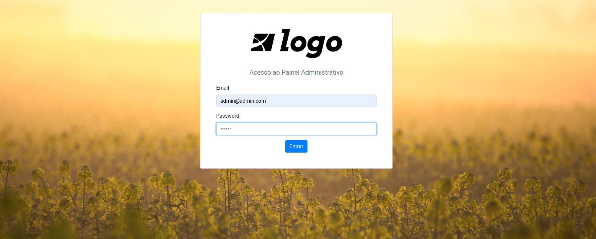

# Rede Social com Ruby on Rails

Projeto da Digital Innovation One para a criação de uma rede social do zero utilizando Ruby on Rails e testes utilizando RSpec

[Link para aplicação online na plataforma Heroku](https://rede-social-rails.herokuapp.com/)

## Imagens

